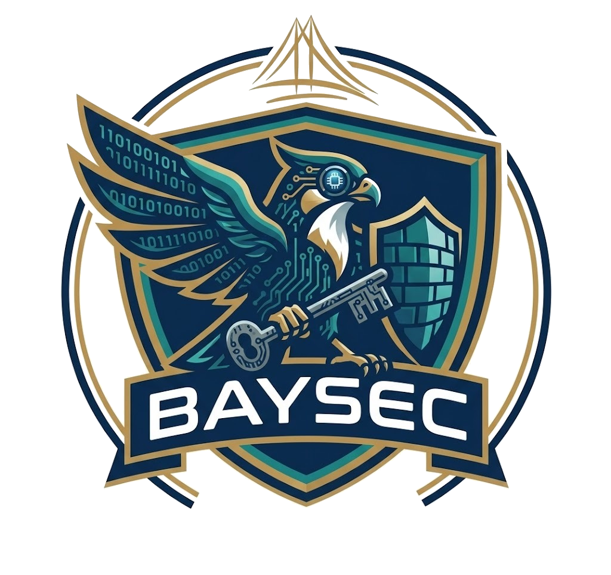
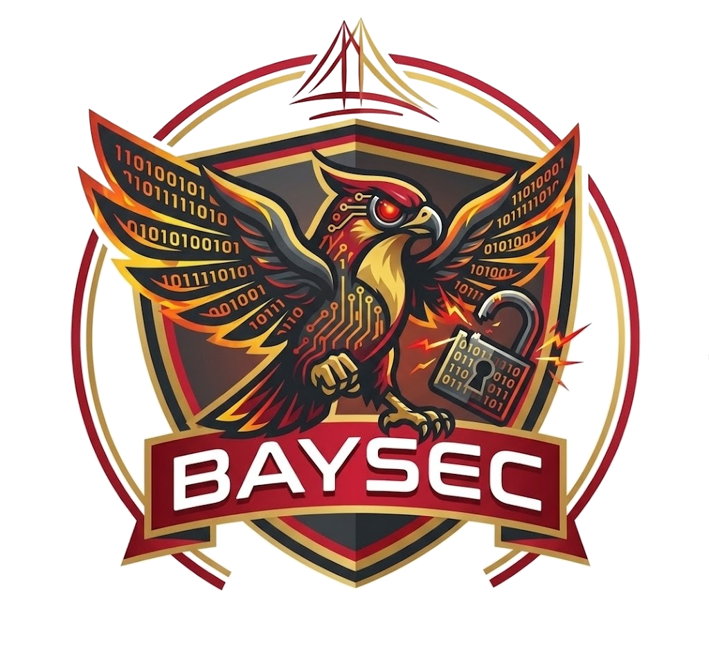

  
  &nbsp;&nbsp;&nbsp;&nbsp;&nbsp;&nbsp;&nbsp;&nbsp;
  

<h1 align="center">BaySec @ SFBU</h1>

  <b>San Francisco Bay University Cybersecurity Club &amp; Challenge Gateway</b>

  

---

## 🌐 Live Portal & Challenges

- **Main Gateway**: [https://MynameisKoi.github.io/baysec/](https://MynameisKoi.github.io/baysec/) *(redirects to active weekly challenge)*
- **League Leaderboard**: [https://MynameisKoi.github.io/baysec/leaderboard.html](https://MynameisKoi.github.io/baysec/leaderboard.html)
- **Week 5 Foundations Presentation**: [https://MynameisKoi.github.io/baysec/week5/presentation.html](https://MynameisKoi.github.io/baysec/week5/presentation.html)
- **Week 5 Challenge (0x02)**: [https://MynameisKoi.github.io/baysec/week5/](https://MynameisKoi.github.io/baysec/week5/) — *Wireshark Packet Analysis & CyberShark*
- **Week 4 Kickoff Presentation**: [https://MynameisKoi.github.io/baysec/week4/presentation.html](https://MynameisKoi.github.io/baysec/week4/presentation.html)
- **Week 4 Challenge (0x01)**: [https://MynameisKoi.github.io/baysec/week4/](https://MynameisKoi.github.io/baysec/week4/) — *BaySec Security Gateway*

---

## 🦅 Brand Crests

| Blue Crest (Defense / Guardian) | Red Crest (Offense / Breaker) |
| :---: | :---: |
|  |  |
| **BaySec Cyber Sentinel** Defensive Security &amp; Key Access | **BaySec Threat Breaker** Offensive Security &amp; Exploitation |

---

## 📁 Repository Structure
- `index.html` — Root redirect to active weekly challenge
- `leaderboard.html` — BaySec Cybersecurity League live leaderboard
- `week5/index.html` — Week 5 challenge: CyberShark Web Packet Analyzer & Flag Verification (Challenge 0x02)
- `week5/traffic_analysis_0x02.pcap` — Real raw binary PCAP capture file downloadable for desktop Wireshark
- `week5/generate_pcap.py` — Python script generating authentic binary PCAP with network telemetry & encoded flag
- `week5/presentation.html` — Interactive browser-based foundations presentation deck
- `week5/BaySec_Week5_Foundations.pptx` — Widescreen 16:9 PowerPoint presentation with speaker notes
- `week5/generate_presentation.py` — Python script to generate the .pptx presentation and QR codes
- `week4/index.html` — Week 4 challenge: BaySec Security Gateway (Challenge 0x01)
- `week4/presentation.html` — Interactive browser-based kickoff presentation deck
- `week4/BaySec_Week4_Kickoff.pptx` — Widescreen 16:9 PowerPoint presentation with speaker notes
- `week4/generate_presentation.py` — Python script to generate the .pptx presentation and QR codes
- `assets/BaySec_League_Template.csv` — CSV template for Google Sheets scoring engine
- `assets/` — Official BaySec logos, brand assets, and QR codes

